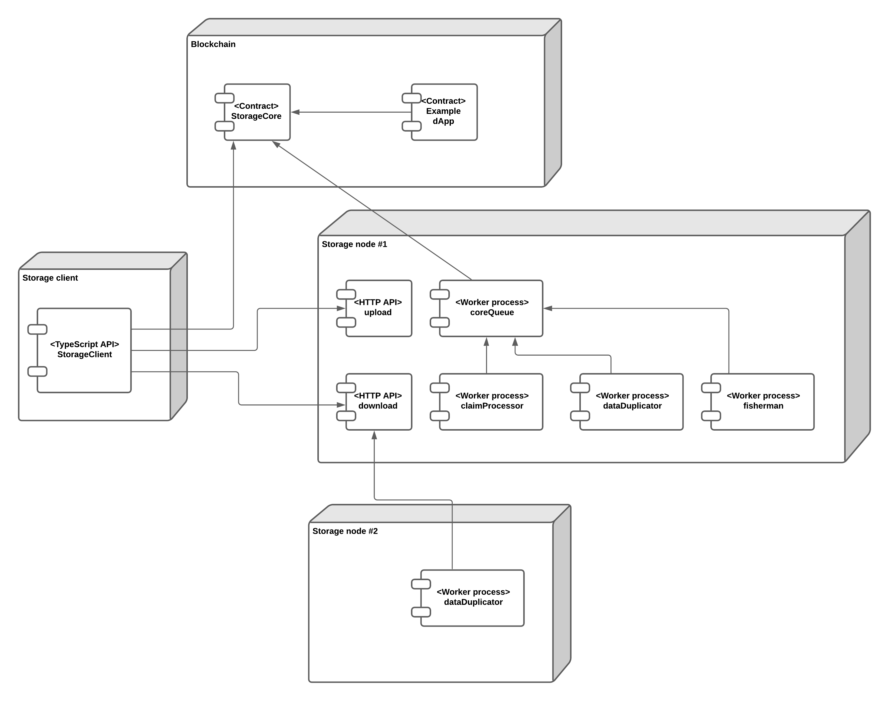
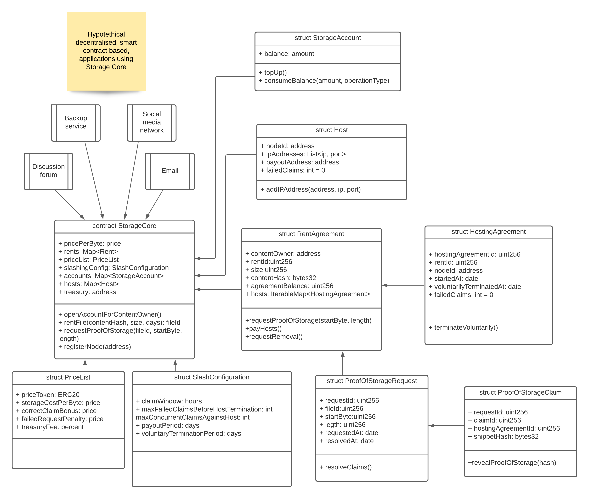

# Storage Core
## Introduction

Storage Core is a proof of concept for smart contract controlled storage: a rent based permanent network storage system consisting of a blockchain, a smart contract and storage nodes. The goal of the proof of concept is to demonstrate that smart contract-based storage is possible in its most primitive format.

Storage nodes are individual servers that manage file storage, uploads and downloads. These nodes are fully decentralised, unlike in the competing solutions. There is no single point of entry gateway server for the system. Storage node data is “context-free”: Owner can request the deletion of actual data (context-free), while the control plane on the blockchain is immutable and always ensures the system integrity.

Storage Core’s file access (create, update, delete) is not controlled by a single private key. Instead, any smart contract can act as a client for Storage Core. Storage Core is a building block that enables easy creation of decentralised publication and communication applications: discussion forums, newsletters, social media sites, personal backup and archive solutions, distributed version control and issue trackers. Another benefit of smart contract-based storage is the tokenisation of the ownership: you can more easily plug-in an open, governance token-based, business model to any of example applications above.

Storage Core internal accounting token can be configured to be any ERC-20 token. The system is designed from the perspective that the payment token will be a stablecoin.

[TOC]

## Deliverables {#deliverables}

This prototype explores the following aspects

*   Capability to upload a file and pay rent for the network for permanently storing this file for a set amount of time
*   Smart contract suite for Storage Core logic
*   A storage node daemon, written in Python 3.8
*   Pytest based storage node test suite
*   UNIX command-line interface for controlling the storage node
*   A web browser compatible client written in TypeScript
*   Node.js based client test suite
*   Example dApp utilising Storage Core
*   All source code licenced under MIT

The research question we want to find an answer for

* What is the meta overhead of number of bytes per file needed to write a blockchain to control the storage

* Is it too expensive to use a blockchain as a control plane for the storage - is the cost of bytes needed to write in a blockchain simply just too expensive to make not possible on any chain

* Related to the cost above: can we use blockchain control panel to store images, tweets, etc.

* What are latencies for the user experience in the optimal scenario
## Out of scope {#out-of-scope}

The prototype does not divulge into

*   Sound economics
*   Peer-to-peer networking
*   Indexers
*   Retrieval markets
*   Performance
*   Encryption
## Differences to competition  {#differences-to-competition}

Some major competition and discussion points

*   Filecoin: Rent agreements are per server, not per network - if your rented server farm goes down you lose your file
*   Filecoin has its own internal blockchain (re)implementation in Go
*   Filecoin manages payments on its own chain
*   Storj: requires an HTTP gateway, called Satellite, that communicates with storage nodes and manages node payments
*   Sia: requires an HTTP gateway that communications with nodes
*   EOS / voice.com: Voice.com has a long way to become fully decentralised, though [EOS 2.1 introduces context free data concept on blockchain level](https://eos.io/news/eosio-2-1/)

Some minor projects one needs to keep eye on

*   [DatDot](https://github.com/playproject-io/datdot-research/blob/master/spec/latest.md): an early Polkadot based storage solution, based on idea every node offers some free disk space, still in very much research phase
*   [Crust Network](https://crust.network/): No idea what these guys are up to, but their solution is based on Intel SGX Trusted Execution Environment (TEE)
*   [Textile](https://textile.io/): API mashup to weave together Filecoin, IPFS and libp2p. Main innovation seems to be split between [hot and cold storage layers](https://docs.textile.io/powergate/storage/
#hot-storage-layer).

## Implementation

The first proof of concept is written so that it can run on any EVM.
## Discussion {#discussion}

### Chose of programming languages and frameworks {#chose-of-programming-languages-and-frameworks}

The storage node is written in Python 3.8. The client is written in TypeScript. Web3.py and Brownie libraries are used. The goal of proof of concept is built a prototype fast, not improve overall blockchain ecosystem, as the code will end up being rewritten.
### EVM based smart contracts {#evm-based-smart-contracts}

EVM based smart contracts are used, as tooling for EVMs is far superior in this point and it enables most rapid proof of concept development.
### No retrieval markets {#no-retrieval-markets}

The proof of concept does not have “retrieval markets” or payments for egress data. This would require payment support for API, e.g. using payment channels, where the clients and storage nodes would pay each other for accessing data.

The lack of retrieval markets makes the concept economically unsound, because of easy denial of service attack vector against storage nodes.

### No economics {#no-economics}

There is no sound economic model, but the proof of concept is based on simplified slashing mechanics. Clients pay upfront per byte per day and all the future costs of the file go from this rental agreement budget. Storage nodes do not post bonds but only bleed future rewards until blacklisted. This is not enough to discourage dishonest or malfunctioning nodes.

There is no proof of space-time, only proof of storage. A randomised system challenge is presented to other nodes by a storage node’s fisherman process now and then. Nodes have a time window to respond to this challenge. In the case nodes present mixed responses, a simple majority is chosen as authoritative.

### No indexers or caches {#no-indexers-or-caches}

In a real-world response time scenarios (think web) a client would probably interact with a service node that offers cached results, instead of directly working with a blockchain node. The service node would act as a proxy for uploads and downloads: any operation result would be immediately available until the storage node propagation and blockchain payments take place on the background.

### No peer to peer networking {#no-peer-to-peer-networking}

Storage nodes register their IP addresses and publicly open ports directly on a blockchain. In a real-world production system, nodes would communicate with each other using a robust, proven, P2P solution like [libp2p](https://support.storj.io/hc/en-us/articles/360039432051-Graceful-Exit-Guide). However, this greatly simplified the proof of concept design.

### No nice exits, partitioning or such {#no-nice-exits-partitioning-or-such}

If a storage node wants to exit the network, or downscale hosted files, it must individually terminate every file hosting agreement. This can be thousands of blockchain writes and is infeasible in the proof of concept model.  For example, Storj has [the concept of a graceful exit](https://support.storj.io/hc/en-us/articles/360039432051-Graceful-Exit-Guide).

The network does not have partitioning where some storage nodes would specialise to host certain kind of files, or serve certain clients.

### No file bundles {#no-file-bundles}

It would make sense to bundle smaller files - think e.g. a stream of social media posts where each post text is a file, to larger archives. IPFS has a [CAR](https://github.com/ipld/specs/blob/master/block-layer/content-addressable-archives.md) (contest addressable archive) format for this.

### No transaction relays {#no-transaction-relays}

Proof of concept does not have transaction relays: the storage client needs to have gas money on its address when they want to upload a file. This is not good for user onboarding and initial user experience.

The need to create blockchain native accounts can be solved by having storage nodes providing relay API, like [gas station network](https://docs.openzeppelin.com/contracts/3.x/gsn), and making storage nodes to cover the native blockchain transaction fee, which storage nodes later get back in the Storage Core payment token or blockchain native currency.

### Performance {#performance}

Real-world tolerable application latency is unlikely reachable with the current system, no matter how fast the underlying blockchain is. This would require sharding of both blockchain and storage nodes (all nodes do not host all data).

### Encryption {#encryption}

There is no encryption of data. Encryption would be needed for private communications, like for a private discussion forum. Although this can be done on a layer above Storage Core, a multiple user encrypted data sharing is difficult and should be plugged directly into the protocol. An example prior art here includes e.g. the [Messaging Layer Security](https://datatracker.ietf.org/doc/draft-ietf-mls-protocol/).

### Not a decentralised database {#not-a-decentralised-database}

There is no key-value store or primitives needed to build a decentralised database like [ThreadDB in Textile](https://docs.textile.io/threads/). ThreadDB does not support smart contracts and exists within its own P2P network - we assume whatever blockchain is eventually going to run Storage Core in production is scalable enough to provide key-value store primitive itself.

The smallest context-free storage unit we expect to store in Storage Core is 100-200 bytes - e.g. a tweet. Whatever smaller control logic and metadata needs to be around this, needs to be bundled within the file, stored in smart contracts separately or have specialised indexer servers build for it.

## Architecture {#architecture}

### Deployment diagram {#deployment-diagram}

A sketch how different elements of Storage Core interact.

### Smart contract class sketch {#smart-contract-class-sketch}

A sketch what kind of data structures are needed and how smart contracts control them.

